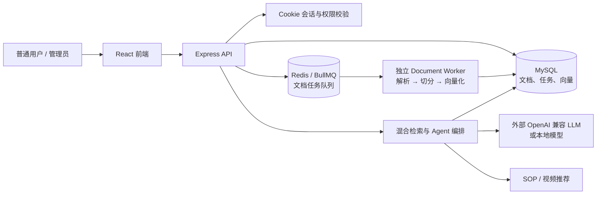

# Xf-RAG｜智能硬件产品知识库问答助手

面向智能硬件产品资料的 RAG 问答系统。管理员上传并审核产品文档、SOP 和操作视频后，用户可以用自然语言提问；系统会在当前用户、产品型号和审核状态的范围内检索资料，返回带来源的答案，并推荐相关 SOP 与视频。

这个项目关注的不只是“调用大模型”，还包括知识库可维护性、检索边界、文件访问安全和本地部署。

## 它解决什么问题？

产品说明、售后 FAQ 和操作视频通常分散在多个文件里。用户遇到问题时，需要翻找文档或等待人工支持；而直接让大模型回答又容易出现型号串资料、引用过期内容或无依据编造的情况。

Xf-RAG 将文档切分、向量化并与元数据一起保存。问答时先过滤无权限、未审核、已废弃或型号不匹配的内容，再进行混合检索和生成；没有可靠资料时，系统会明确说明未命中，而不会回退到其他型号的知识库。

## 用户使用流程

1. 管理员注册并登录，上传 PDF、DOCX、Markdown 或 TXT 产品资料。
2. 系统解析文档、切分内容并生成向量；管理员可审核 SOP 和操作视频。
3. 用户选择产品线/型号后提问，例如功能说明、参数、故障排查或操作步骤。
4. 系统返回带文档来源的答案，并按问题推荐已发布的 SOP 和视频章节。
5. 管理员根据未命中问题和问答记录补充资料，持续完善知识库。

## 系统架构



## 核心能力

- **文档知识库**：支持 PDF、DOCX、Markdown、TXT 上传；PDF/DOCX 可使用 MinerU 解析，也可回退到本地解析。
- **可恢复后台解析**：上传仅创建持久化任务；独立 Worker 解析、切分和向量化，页面展示真实进度，支持失败重试和取消。
- **混合检索问答**：结合关键词检索、向量语义检索、重排、查询改写与对话记忆，支持流式回答和来源追溯。
- **可信回答与追溯**：回答中的每个事实块都必须绑定已检索的来源；资料不足、型号不匹配或越权指令会明确拒答，并记录检索证据、分数、耗时和用户反馈。
- **多工具 Agent**：可按问题选择知识库检索、摘要、文档管理、SOP 查询和视频检索等工具。
- **产品资料隔离**：检索时按用户、产品线、产品型号、审核状态和废弃状态过滤，避免跨型号回答。
- **SOP 与视频推荐**：根据问题关键词推荐已审核 SOP 和已发布操作视频；支持视频章节和解决状态记录。
- **SOP 视频工作室**：管理员可将结构化 SOP 一键渲染为可下载的操作演示视频（Canvas 动画 + 场景编排 + 配音/字幕轨预留），无需外录。
- **安全访问控制**：使用 HttpOnly Cookie 会话、角色权限、登录/问答限流和受保护的上传资源路由；上传文件不会被整个目录公开暴露。
- **可重复迁移**：统一迁移脚本可幂等创建和升级数据库表、索引与约束，兼容旧结构。

## 技术栈

| 范围 | 技术 |
| --- | --- |
| 前端 | React、Vite、DOMPurify、Marked |
| 服务端 | Node.js、Express、SSE、JWT Cookie、Zod |
| RAG / Agent | LangChain、LangGraph、Function Calling、BM25、Embedding、Rerank |
| 数据与文件 | MySQL 8、Redis 7、BullMQ、Multer、MinerU、PDF/DOCX 解析 |
| 本地推理 | `@xenova/transformers`、`bge-small-zh-v1.5`、Qwen 本地回退模型 |
| 工程化 | Node Test Runner、GitHub Actions、npm Scripts |

## 工程设计重点

### 1. 可信检索优先于“有答案”

型号过滤没有命中时，系统不会退回到其他型号的知识库。这样做会降低部分问题的“看似回答率”，但可以避免把错误的产品资料当成答案返回。

### 2. 文档与上传资源受权限保护

文档、缩略图和视频资源都通过鉴权路由读取；上传接口限制文件类型、大小和压缩包解压规模。普通用户不能审核、发布或修改其他人的内容。

### 3. 解析任务可恢复

上传文件后，API 会先在 MySQL 创建 `document_jobs` 任务，再写入 Redis 队列；独立 Worker 才负责解析、切分和向量化。API 重启会协调未入队的已保存任务，Worker 重启则由 BullMQ 保留等待和重试状态；最终失败的队列任务会同步为页面可见的失败状态。Redis 暂不可用时，上传最多等待 `DOCUMENT_QUEUE_TIMEOUT_MS` 后返回队列不可用提示，已保存任务会在 Redis 恢复后重新协调。页面只显示服务端真实的排队、处理、完成、失败或已取消状态，不会伪造“解析完成”。

### 4. 数据库结构可升级

`npm run db:migrate` 是唯一推荐的建库和升级入口。它会创建缺失表、字段、索引和约束，并修正旧版本中跨文档问答外键不允许为空等兼容问题。升级时发现旧版遗留的“处理中”文档，会自动创建可恢复的后台任务并重新排队。

## 本地运行

### 环境要求

- Node.js 22
- MySQL 8
- Docker Desktop（用于本机 Redis 7）
- 首次加载本地 Embedding/LLM 时需要下载模型；建议预留至少 1 GB 磁盘和 8 GB 内存

### 1. 安装与配置

```bash
npm ci
copy .env.example .env
```

编辑 `.env`，至少设置以下配置：

```ini
DB_HOST=localhost
DB_PORT=3306
DB_USER=root
DB_PASSWORD=your_db_password
DB_NAME=iflytek_translator
JWT_SECRET=replace_with_a_long_random_secret
REDIS_URL=redis://127.0.0.1:6379
DOCUMENT_WORKER_CONCURRENCY=2
DOCUMENT_JOB_MAX_ATTEMPTS=3
DOCUMENT_QUEUE_TIMEOUT_MS=5000
```

可选配置：

- `LLM_BASE_URL`、`LLM_API_KEY`、`LLM_MODEL`：接入兼容 OpenAI 的模型服务；未配置时使用本地模型回退。
- `MINERU_API_KEY`：启用更完整的 PDF/DOCX 解析。
- `ADMIN_USERNAMES`、`ADMIN_REGISTRATION_KEY`：配置管理员注册和审核权限。
- `CORS_ORIGINS`：生产环境必须限制为实际前端域名。
- `REDIS_URL`、`DOCUMENT_WORKER_CONCURRENCY`、`DOCUMENT_JOB_MAX_ATTEMPTS`、`DOCUMENT_QUEUE_TIMEOUT_MS`：文档后台任务队列配置；本机默认 Redis 地址为 `127.0.0.1:6379`，每个任务最多自动重试 3 次，Redis 操作默认 5 秒后返回可恢复错误。

### 2. 初始化数据库

```bash
npm run db:migrate
```

> `npm run server` 启动时也会执行迁移；单独运行本命令便于首次安装时确认数据库配置正确。

## Docker 一键部署：本机、局域网与公网

Docker Compose 会同时运行前端、API、文档 Worker、MySQL 和 Redis，并用命名卷保留数据库、上传文件和模型缓存。下面命令在仓库根目录执行。

> **镜像加速配置**：构建会拉取 `node:22-bookworm-slim`、`mysql:8.4` 和 `redis:7` 基础镜像。如果 `docker compose ... build` 或 `docker pull` 因连接 Docker Hub 超时失败，请在 Docker Desktop 的 **Settings → Docker Engine** 配置镜像加速器，并在 JSON 中声明可用的 `registry-mirrors` 地址（地址请使用你当前可用、可信的镜像源）。保存并重启 Docker Desktop 后，用 `docker pull node:22-bookworm-slim` 验证连通：
>
> ```json
> {
>   "registry-mirrors": [
>     "https://<你的镜像加速地址>"
>   ]
> }
> ```
>
> 镜像加速地址会随服务商调整，只填写可信来源；正式部署前先完成一次镜像拉取验证。

1. **全新安装**：复制 Compose 环境模板到新的 `.env.compose`，并在启动前替换**每一个**占位符。生产用 `JWT_SECRET` 必须是至少 32 个字符的随机值；`MYSQL_ROOT_PASSWORD`、`MYSQL_APP_USER` 和 `MYSQL_APP_PASSWORD` 也必须替换为独立的强密码。`.env.compose` 含有密钥，不能提交到 Git。

   ```powershell
   copy deploy\.env.compose.example .env.compose
   ```

2. **已有数据的部署升级**：不要复制或覆盖现有的 `.env.compose`；保留真实密钥和设置，对照更新后的模板，只刻意新增新版所需变量。在旧版 MySQL 服务、数据和配置仍保持可用时、拉取/重建/运行可能自动执行迁移的新版本之前，先执行备份。确认命令输出的绝对路径并妥善保存该 SQL 文件。

   ```bash
   npm run db:backup [optional backups/file.sql]
   ```

3. 先用下面的命令校验你填写的实际用户部署配置，再启动服务；查看状态和日志时也显式使用同一个环境文件。停止服务使用 `down`，它不会删除命名卷。

   ```bash
   docker compose --env-file .env.compose config
   npm run compose:up
   # 等价的完整启动命令：
   docker compose --env-file .env.compose up --build -d

   docker compose --env-file .env.compose ps
   docker compose --env-file .env.compose logs -f api worker
   npm run compose:down
   ```

4. 在**同一台电脑**上使用 `http://localhost:3000` 打开系统。

5. 仅做同一 Wi-Fi 的受控测试时，在 `.env.compose` 中设置 `APP_BIND_ADDRESS=0.0.0.0`，使用 `ipconfig` 找到这台电脑的 IPv4 地址，并在 Windows 防火墙允许 TCP 3000；另一台设备访问 `http://<电脑局域网 IP>:3000`。局域网 HTTP 仅用于受控测试，不能当成公网发布。

6. 面向真实客户的公网二维码需要一台服务器、域名、反向代理和 HTTPS。部署时设置 `NODE_ENV=production`，并设置非 localhost 的 HTTPS `PUBLIC_APP_URL`（例如 `https://support.example.com`）；只有完成这些条件后，才生成或印刷用于公开分发的二维码。不要把局域网地址描述为公网发布地址。

7. 执行数据变更前先备份；可自定义输出文件路径。恢复会改写数据，必须已有备份并先在一次性测试数据库演练；恢复命令不会停止服务或删除卷，但仍需人工明确确认。

   ```bash
   npm run db:backup [optional backups/file.sql]
   # 第二个 -- 用于把确认标志原样传给 npm 脚本
   npm run db:restore -- backups/file.sql -- --confirm-restore
   ```

8. Docker Linux engine 可用后，仍需完成以下人工验收：镜像构建、一次性 Compose 启动、`/api/live` 与 `/api/health`、API 重启后的 Worker 恢复、局域网访问、备份/恢复演练、公网二维码流程，以及由你本人完成的 30 题 RAG 实测。最后一项是用户测量，不是自动生成的质量分数。

## 扫码产品支持二维码：配置、测试与发布

二维码只保存一个随机入口编号，用于打开固定产品型号的支持问答页面；**二维码不是身份凭证**。无论扫码还是直接访问 URL，普通用户仍必须使用现有账号登录，不能匿名提问。

按以下顺序配置和验证：

1. 在 `.env` 中设置 `PUBLIC_APP_URL`、`ADMIN_USERNAMES`、`ADMIN_REGISTRATION_KEY` 和 `JWT_SECRET`。本机开发可使用 `PUBLIC_APP_URL=http://localhost:3000`；`JWT_SECRET` 必须使用生产强度、足够长的随机值，不要把真实密钥写入 README、代码或提交记录。生产环境的 `PUBLIC_APP_URL` 必须是实际可访问的 HTTPS 公网域名，例如 `https://support.example.com`。
2. 先执行 `npm run db:migrate`，再使用 `ADMIN_USERNAMES` 中的账号注册或登录管理员（注册时提供 `ADMIN_REGISTRATION_KEY`）。管理员在管理界面创建固定产品线/产品型号的入口并下载二维码。本地可用 URL 形状为 `/support/<channelCode>` 测试；`localhost` 仅限本地开发，必须在设置真实 HTTPS 公网域名后，才可印刷或分发生产二维码。
3. 使用**独立的普通测试账号**打开或扫描该二维码，在仍保留 `/support/<channelCode>` URL 的情况下登录。确认页面只针对二维码绑定的型号提问，且现有可信 RAG 回答、来源跳转、视频推荐和反馈行为仍可用。
4. 手工验收失效边界：格式错误、已停用或已轮换的 code 必须显示“入口不可用”，且不得发送 RAG 请求或回退到通用资料。普通用户尝试管理 API 必须得到 `403`；管理员可以创建、编辑、下载、停用和轮换二维码入口。

### 生产迁移注意事项

生产迁移前先完成数据库备份。`support_channels` 是本功能新增的表；不过为谨慎升级，首次迁移仍会清理早期或手工创建的重复入口行。V1 规则是一个管理员、一个产品线和一个产品型号只能对应一个二维码入口；遇到重复行时，迁移优先保留启用中的行，否则保留最新的行（再以较新的 ID 作为确定性取舍）。请在备份后检查迁移结果，再执行二维码打印或分发。

## 本地开发启动（非 Docker）

首次创建本机 Redis 容器：

```bash
docker run -d --name xf-rag-redis --restart unless-stopped -p 127.0.0.1:6379:6379 -v D:\DockerData\redis:/data redis:7-alpine redis-server --appendonly yes
```

日常启动时，先确保 Docker Desktop 已开启，再运行：

```bash
docker start xf-rag-redis
```

然后在三个终端中分别运行：

```bash
# 终端 1：API 服务
npm run server
```

```bash
# 终端 2：文档后台 Worker（必需）
npm run worker:documents
```

```bash
# 终端 3：前端开发服务
npm run dev
```

- 前端：`http://localhost:5173`
- API：`http://localhost:3000`
- 健康检查：`http://localhost:3000/api/health`

上传 API 会立即返回 `202` 和任务状态；不要关闭 Worker，否则新任务会安全地保留在 Redis 中，直到 Worker 下次启动。

## 文档任务的状态与操作

- `queued`：文件已保存，等待 Worker；同一用户再次上传完全相同的文件会复用已有任务。
- `processing`：Worker 正在解析、切分或建立向量；前端每两秒刷新真实进度。
- `completed`：内容和语义块已可检索。
- `failed`：页面显示经过脱敏的原因，可以点击“重新提交”创建新的任务记录。
- `cancelled`：等待任务会立即取消；正在处理的任务会在下一个安全边界停止。任务处于排队或处理中时，请先取消，等待成为终态后再删除文档。

## 验证与持续集成

```bash
npm run lint
npm run test:document-jobs
npm test
npm run build
```

GitHub Actions 会在临时 MySQL 8 环境中执行数据库迁移、自动化测试和生产构建。

### 30 题 RAG 基线评测

评测集固定为 30 条 4.0 大陆版产品问题，其中 E26、E29、E30 必须拒答。题目、正确答案要点、期望资料、拒答预期和对应型号保存在 [test/fixtures/rag-evaluation.json](test/fixtures/rag-evaluation.json)。

先在网页或接口中完成真实测试，再把观察结果保存为一个本地 JSON 文件（不要提交该文件）：

```json
[
  {
    "id": "E01",
    "result": "通过",
    "sourceTitles": ["快速入门指南"],
    "citationAccurate": true,
    "latencyMs": 1200,
    "totalTokens": 456,
    "note": "第一句直接回答，无联网激活说法"
  },
  {
    "id": "E26",
    "result": "通过",
    "refusalFollowed": true,
    "latencyMs": 800
  }
]
```

执行下面的命令会生成 `reports/rag-evaluation-report.md`。`result` 可填写“通过 / 部分通过 / 失败”（也兼容英文）；未提供实测文件时，报告会如实显示“待实测”，不会生成虚假的成功率；记录了失败或拒答失败时命令会返回失败状态，便于持续集成拦截回归。

```bash
# 先生成空白（待实测）报告
npm run eval:rag

# 根据你的真实测试记录生成指标报告
npm run eval:rag -- --input D:\path\to\rag-evaluation-results.json
```

当前历史离线检索基线为 27/27 应答题 Top-3 命中；这只证明资料检索覆盖，不能代表本次可信回答链路已经通过真实问答。完整题目依据与旧基线见 [评测说明](docs/2026-08-28-rag-evaluation-baseline.md)。

## MCP 接入（可选）

可通过 stdio MCP Server 向其他 Agent 客户端暴露知识库检索、完整问答、SOP 查询和视频检索能力：

```bash
node server/mcpServer.js
```

启动前必须在 `.env` 中设置 `MCP_USER_ID`，确保 MCP 只读取指定用户的知识库。

## 已知边界与后续方向

- 当前后台任务方案面向单机部署：Redis、API 和 Worker 需要由同一台主机的进程管理器守护；多机部署时应使用共享 Redis、独立 Worker 进程和集中式日志/监控。
- 当前向量保存在 MySQL，并由应用侧加载计算；文档规模增长后应迁移到带索引的向量方案，例如 pgvector、Milvus 或 Qdrant。
- 单进程限流和对话记忆适合单实例部署；多实例环境应将限流和会话状态迁移为共享存储。

## 项目文档

- [快速入门指南](docs/快速入门指南.md)
- [用户操作手册](docs/用户操作手册.md)
- [产品功能说明](docs/产品功能说明.md)
- [售后 FAQ](docs/售后FAQ.md)
- [安全说明](docs/安全说明.md)
